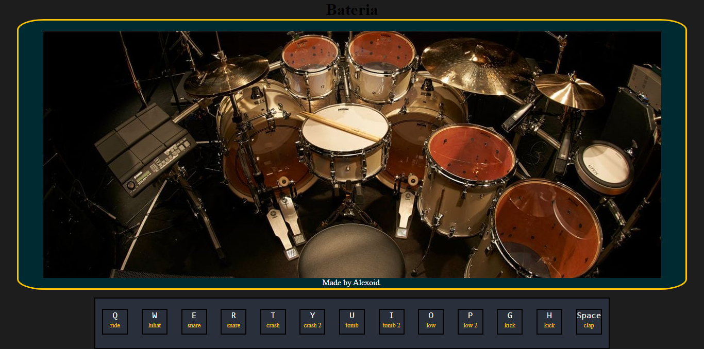

# Virtual-Drum
## Emulate a drum with the keyboard

Additional description about the project and its features.

## Built With

- HTML,
- JavaScript
- Css

## Live Demo

[Live Demo Link](https://alexoid1.github.io/Virtual-Drum/)

## Getting Started

**Navigation bar**
- Go to (https://alexoid1.github.io/Virtual-Drum/) and have a look around. 

In this project:

- Add border efect on every keyboard event.
- Add diferent sounds in every keyboard and click event.

To get a local copy  and to set it up and running follow these simple example steps.

### Prerequisites

- Browser
- Internet
- Download the code from repository (https://github.com/Alexoid1/Virtual-Drum)

## Author

👤 **Pablo Alexis Zambrano Coral**

- Github: [@Alexoid1](https://github.com/Alexoid1)
- Twitter: [@pablo_acz](https://twitter.com/pablo_acz)
- Linkedin: [linkedin](https://www.linkedin.com/in/pablo-alexis-zambrano-coral-7a614a189/)

## Show your support

Give a ⭐️ if you like this project!

## 📝 License

This project is [MIT](LICENSE) licensed.#
